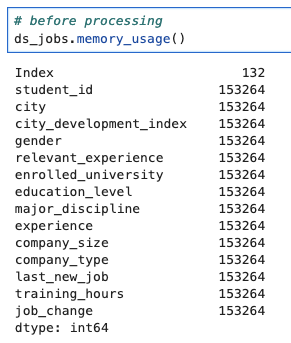
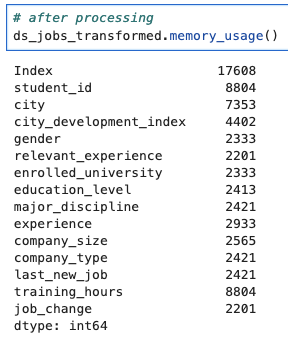

# README: Efficient Data Storage for Customer Dataset

## Project Overview
This project involves transforming the **customer_train.csv** dataset into a more storage-efficient format for use in predictive modeling. The transformation adheres to specified data type requirements to reduce memory usage and enhance performance for downstream machine learning tasks.

The dataset contains anonymized information about students and their job-seeking status during training. Efficient storage is critical to handling large-scale data and ensuring faster model predictions, enabling actionable insights in reasonable timeframes.

---

## Dataset Description
The **customer_train.csv** file includes the following columns:

| **Column Name**       | **Description**                                           |
|------------------------|-----------------------------------------------------------|
| `student_id`          | A unique ID for each student.                             |
| `city`                | A code for the city the student lives in.                 |
| `city_development_index` | A scaled development index for the city.               |
| `gender`              | The student's gender.                                     |
| `relevant_experience` | Indicates if the student has relevant work experience.    |
| `enrolled_university` | Type of university course enrolled in (if any).           |
| `education_level`     | The student's education level.                            |
| `major_discipline`    | Educational discipline of the student.                    |
| `experience`          | The student's total work experience (in years).          |
| `company_size`        | Number of employees at the student's current employer.    |
| `company_type`        | Type of company employing the student.                    |
| `last_new_job`        | Years between the student's current and previous jobs.    |
| `training_hours`      | Hours of training completed.                              |
| `job_change`          | Indicator if the student is looking for a new job (1/0).  |

---

## Transformation Requirements
The dataset is transformed into a new DataFrame named `ds_jobs_transformed` with the following data type optimizations:

1. **Binary Categorical Columns:**  
   Columns with only two unique values (e.g., `True`/`False`, `Yes`/`No`) are stored as **Booleans (`bool`)**.

2. **Integer Columns:**  
   Columns containing only integers are stored as **32-bit integers (`int32`)**.

3. **Floating-Point Columns:**  
   Columns containing floating-point values are stored as **16-bit floats (`float16`)**.

4. **Nominal Categorical Columns:**  
   Columns with nominal (unordered) categorical data are stored using the **`category` data type**.

5. **Ordinal Categorical Columns:**  
   Columns with ordinal (ordered) categorical data are stored as **ordered categories**, reflecting the natural order of the column values.

---

## Purpose of Transformation
Efficient storage is vital when dealing with large datasets. By optimizing the data types:
- **Memory Usage** is reduced, enabling handling of larger datasets.
- **Processing Time** for model training and predictions is significantly improved.
- **Scalability** for future expansion is enhanced.

---

## Implementation
### Steps:
1. **Load the Dataset:**  
   Read `customer_train.csv` into a Pandas DataFrame.

2. **Identify Column Types:**  
   Use exploratory analysis to classify each column as binary, nominal categorical, ordinal categorical, integer, or floating-point.

3. **Apply Transformations:**  
   Convert columns to the specified data types using Pandas methods like `.astype()`, `pd.Categorical()`, and `.CategoricalDtype()`.

4. **Validate:**  
   Ensure the transformed DataFrame meets the requirements and preserves data integrity.

### Example Code Snippet:
```python
import pandas as pd
import numpy as np

# Load the dataset
df = pd.read_csv("customer_train.csv")

# Initialize the transformed DataFrame
ds_jobs_transformed = df.copy()

# Transformations
ds_jobs_transformed['job_change'] = ds_jobs_transformed['job_change'].astype('bool')
ds_jobs_transformed['training_hours'] = ds_jobs_transformed['training_hours'].astype('int32')
ds_jobs_transformed['city_development_index'] = ds_jobs_transformed['city_development_index'].astype('float16')
ds_jobs_transformed['education_level'] = pd.Categorical(ds_jobs_transformed['education_level'], ordered=False)
```

---

## Next Steps
1. Validate the storage efficiency by comparing memory usage before and after the transformation.
<div style="display: flex; justify-content: center; align-items: center;">
  
  
</div>
2. Use `ds_jobs_transformed` in predictive modeling tasks to ensure performance gains.
3. Extend the transformation pipeline for integration with the full dataset.

---

## Acknowledgments
Thank you James Chapman from Datacamp for another informative and hand-on project.
